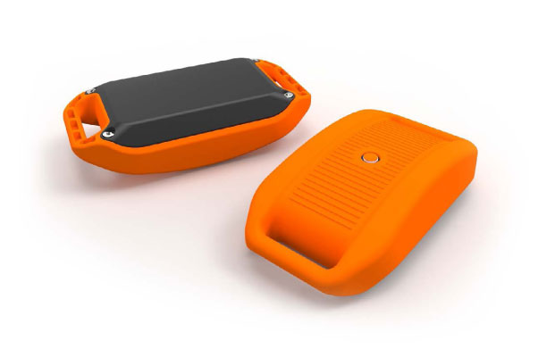
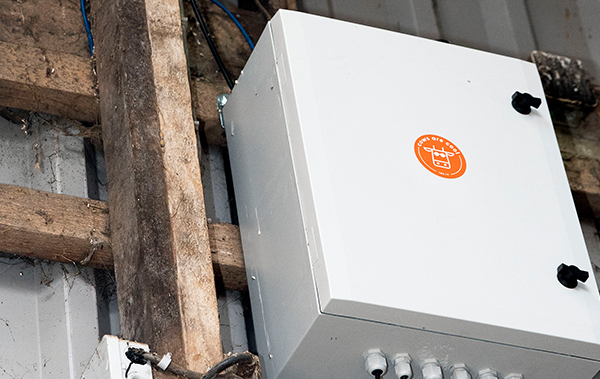
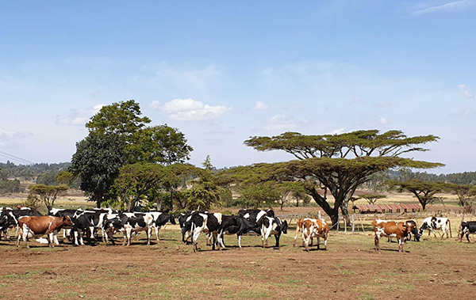

# Hardware to support farms of all sizes

### Ida functions on farms of various herd and land sizes.

### Ida Sensor

Our sensor hardware is the primary data source for Ida to build insights for your farm and herd. 

### Farm Management Systems

Ida supports integration with any farm management system with many popular farm management systems available from the first day of your deployment. 

### Third Party Data Sources and Hardware

We support several third part data sources and hardware platforms such as sorting gates and sensing platforms. Talk to us if you have a specific requirement. 

### The Sensor

**Ida’s sturdy sensors fit onto a collar around the cow’s neck. All data collected is analysed and provides insight and actions to the farmer through easy to understand data visualisations on their smartphone/tablet.**

- Neck Mounted sensor, no requirements for orientation or counterbalance weight,
- Simple to install and non-invasive,
- Battery life of ~3-5 years, replaced free of charge as long as use subscription is active,
- Measures 7 distinct behaviours (more than any existing competing solution): Eating, Ruminating, Walking, Standing, Laying, Chewing count and Idle. New behaviours are constantly being added as our sensor is a learning-based system,
- Support for pasture-based systems,
- Works on any internet connection or 3G/4G router systems,
- Range of 1KM+,
- Waterproof, shockproof and tested extensively on existing farms,
- All-inclusive sensor warranty.

### The Base Station

**Ida trackers transmit data to the base station, the base station sends the data to the cloud.**

- Hub-based model allows Ida to be used in all types of dairy systems:
- free-grazing, free stall, etc.
- Designed to be used in industrial environments.
- Processes up to thousands of concurrent sensors.
- Remote field access points integrate with the base station to enable coverage of large areas.
- Requires wired internet access.

### Field Access Points

**No farm is too big or too small for Ida. By making use of remotely managed field access points, Ida is sure to capture all of your cow’s data.**

- Remote radio stations that help cover large farms and grazing environments.
- Built for ‘plug and play’ operation.
- Solar powered versions are also available for coverage of large areas.
- Remotely managed.

